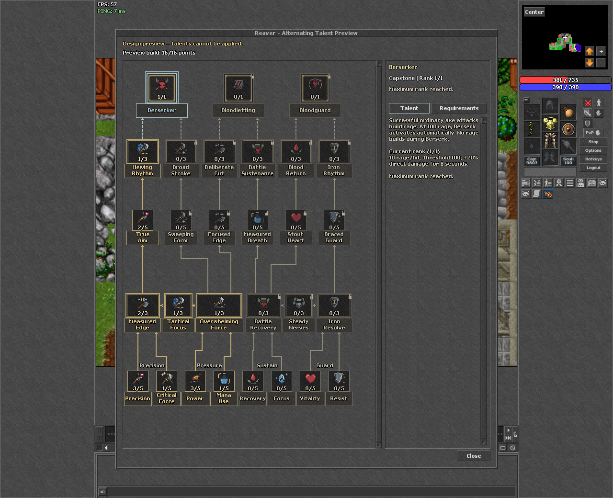
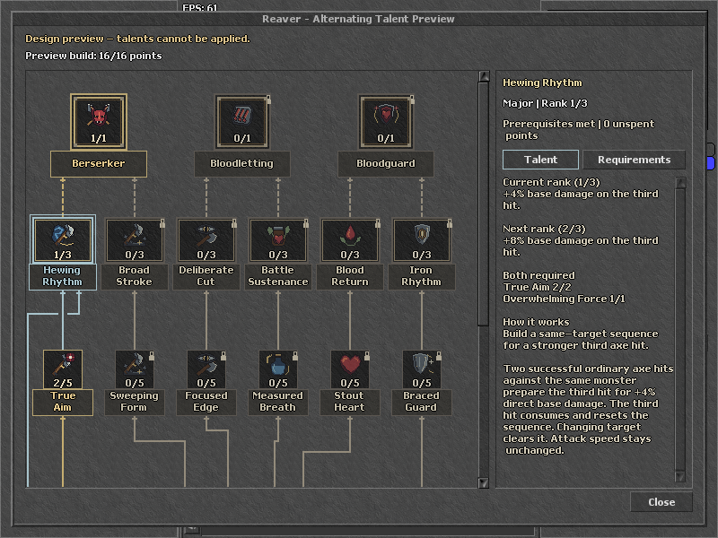

# Reaver: alternating talent routes

Status: local design revision, not server gameplay implementation. This supersedes the all-major upper progression in the earlier 23-node sketch. The detached rule proof passes; the native rendering evidence is recorded below.

## Main progression

**Minor → core Major → route Minor → advanced Major → Capstone.**

The draft has 29 independent talents: 14 Minors, 12 Majors and 3 Capstones. All 17 existing IDs and the six previously proposed Major effects are retained. Six new middle-tier Minors provide small stat choices. Minors have five ranks, Majors three, Capstones one. No paired cards or mutually exclusive pairs are introduced.

Tactical Focus and Steady Nerves remain optional side branches with their existing requirements. They do not form another compulsory Major tier. The main route spine alternates; these optional bridges retain their original Major dependencies.

## Routes and gates

| Capstone | Route Minor | Advanced Major | Own core 2 | Secondary core 1 |
| --- | --- | --- | --- | --- |
| Berserker | Sweeping Form | Broad Stroke | Overwhelming Force | Measured Edge |
| Berserker | True Aim | Hewing Rhythm | Measured Edge | Overwhelming Force |
| Bloodletting | Focused Edge | Deliberate Cut | Overwhelming Force | Battle Recovery |
| Bloodletting | Measured Breath | Battle Sustenance | Battle Recovery | Overwhelming Force |
| Bloodguard | Stout Heart | Blood Return | Battle Recovery | Iron Resolve |
| Bloodguard | Braced Guard | Iron Rhythm | Iron Resolve | Battle Recovery |

A route Minor requires its own core at rank 2. Its advanced Major requires **that specific route Minor at rank 2 AND the named secondary core at rank 1**. Its core's original four-point combined Minor gate still applies. Unrelated trained talents cannot substitute for the named lineage.

Each Capstone requires **either of its two named advanced Majors at rank 1**, 15 points in other talents, and only one active Capstone. Both routes may be trained when affordable; training the other route never grants a second Capstone.

## Proposed middle-tier values

These are unimplemented starting values, not validated hunting balance. Each value is per rank, up to five ranks.

| Minor | Proposed benefit per rank |
| --- | --- |
| Sweeping Form | +0.5% direct damage to Cleaving Arc's secondary monster hits. |
| True Aim | +0.2 percentage points of ordinary axe critical chance. |
| Focused Edge | +0.5% primary direct damage for learned, allowlisted axe spells. |
| Measured Breath | 1% reduced mana cost for eligible axe spells. |
| Stout Heart | +0.5% maximum HP. |
| Braced Guard | 0.5% reduced direct physical damage taken from monsters. |

Existing proposed Major numbers are retained. Added Minor benefits and a secondary core reduced from rank 2 to rank 1 change allocation and balance; this is not a claim that balance is unchanged. Final effects must remain in the central tracked passive balance config and be tested with normal learned spells and low-damage rounding.

## Progression and choices

- A first core rank 2 costs six points: four foundation Minor points plus two core ranks.
- A first middle-tier Minor unlocks at seven points, level 13.
- An advanced Major needs 14 points, level 34: six own-core points, two route-Minor points, five secondary-core points and one advanced rank.
- A first Capstone needs 16 points, level 40. Its required lineage totals 15 including the Capstone, leaving **one elective point** to meet the 15-other-points gate.
- Preparing both routes within one Capstone family requires 19 total points with one active Capstone.

| Prepared Capstone destinations, with one active | Minimum points |
| --- | ---: |
| Any one | 16 |
| Berserker + Bloodletting | 23 |
| Bloodletting + Bloodguard | 23 |
| Berserker + Bloodguard | 29 |
| All three | 32 |

The 24-point budget permits late adjacent hybrids, not all three destinations. Choice at level 40 includes the route, the distribution of foundation Minor points and one elective rank. It does not promise broad elective freedom at that milestone.

## Detached rule verification

Python and the exact extracted current client Lua requirement/validation functions both pass **94 named cases: 67 legal builds and 27 rejections, including 921 valid purchase prefixes**. The Lua proof additionally checks 448 minimum-closure witnesses across all 64 advanced-endpoint subsets and verifies the saved-rank respec guard.

The cases cover both routes to each Capstone at exactly 16 points, legal 24-point single/adjacent-hybrid builds, insufficient points, missing own/secondary cores, wrong route Minors, impossible opposing/all-family readiness at 24, two active Capstones, rank ceilings and undoing a sole prerequisite versus retaining another valid alternative. Minimum calculations include exactly one active Capstone.

Original 23 IDs/order, six proposed Major effect copies, original core and optional-side rules are preserved. Changed advanced/Capstone nodes have no stale compact prerequisite metadata. This verifies topology and point accounting, not combat behavior, rounding or live server protocol compatibility.

Evidence: [Python proof](../out/tree-choice-research/alternating/python-results.json), [actual client Lua proof](../out/tree-choice-research/alternating/lua-results.json), [detached reproduction notes](../out/tree-choice-research/alternating/README.md).

The shared catalog receiver currently requires exactly 17 nodes and validates node types and coordinates. Gameplay implementation must version and update the client/server catalog contract and migrate saved builds: preserving IDs/order alone does not keep older Capstone builds legal after their prerequisites change. The preview does not bypass this limitation in the normal client.

## Connector cleanup and native presentation

The isolated retro client connected to the unchanged local test server. Final captures completed at **1280x1040, 1280x800 and 800x600**, with a clean logout and ALTERNATING_NATIVE_OK.

The previous routing had 132 nonzero centreline segments, **10 strict perpendicular crossings and 25 collinear overlaps**. Earlier clearance checks avoided names and frames but missed line-to-line ambiguity. The baseline is preserved in [connector-before](../out/tree-choice-research/alternating/connector-before/routing-baseline.json).

### Presentation changes

- All **36 logical dependency pairs** remain intact. The overview shows 30 main/optional connections. Inspecting an advanced Major shows its one additional supporting-core connection; inspecting another talent hides it again.
- Consecutive tiers connect through short, separate ports on the talent cards. Middle Minors and advanced Majors form vertical chains. Each Capstone has two separate incoming ports, with no merged alternative trunk.
- Supporting connections use the outer gutter. Small gaps are cut only into the contextual supporting stroke where it passes a main path; the main path stays continuous.
- Mandatory links are solid. OR alternatives are dashed. Unused OR inputs are neutral when the other alternative qualifies; a missing mandatory support remains visibly missing.
- The default Talent inspector shows **Both required**, naming the route Minor and supporting core with current/required ranks. Benefits and both requirement rows fit initially at 800x600. The full Requirements tab retains clickable and keyboard-accessible prerequisite rows.
- Foundation gates still require four **combined** Minor ranks and allow 4+0. Advanced gates are AND; Capstone routes are OR. This cleanup changes neither rule nor cost.
- Inspection stays cyan and investment gold. Native focus previously reapplied a default gold border to untrained Capstones; the disposable preview now updates both the base and focused style so inspection cannot leave that false state.
- Precision, Pressure, Sustain and Guard headings remain. The rejected persistent legend, formula strip and footer key remain absent. All glyphs stay at 32px.

### Verification

An independent audit compares every canonical non-layout node field, all 36 dependency pairs and all positions/nameplates against the earlier render. The catalog hash is unchanged. It compares **75,460 emitted-rectangle pairs across seven visible configurations**, with zero unrelated overlaps. Separate geometric checks cover the actual two-pixel strokes and target attachment ports; readable name areas are not exempted.

The connected native run checks **29 talent selections and 12 supporting met/unmet cases**, actual widget rectangles, visibility reset, main continuity, card/heading clearance and the six advanced benefit/AND summaries. All three viewport sizes pass. The capture fixture restores both saved and draft ranks; actual border getters match each talent's state after focus changes.

These are application-handler/native-widget checks, not OS pointer/keyboard dispatch or manual hunting. The earlier 60 proposed-rank-state and 29-node keyboard-handler run remains partial historical evidence because it later disconnected before completing its captures. Its [log](../out/tree-choice-research/alternating/native-handler-checks.log) remains separate; the current connector run completes successfully. Unchanged positions preserve the previous navigation geometry.

The proposed effects were not executed. Incoming passive catalogs and outgoing passive mutations are blocked in the isolated preview. The base package and shared source were not modified by this connector pass; shared presentation source had been edited earlier in the task.

Evidence: [current connector results](../out/tree-choice-research/alternating/connector-results.json), [independent audit](../out/tree-choice-research/alternating/connector-independent-audit.json), [final native log](../out/tree-choice-research/alternating/native-connector-capture.log), [geometry proof](../out/tree-choice-research/alternating/geometry-results.json), [preview manifest](../out/tree-choice-research/alternating/native-preview/preview-manifest.json).

### In-game images

[Complete advanced inspection](images/reaver-alternating-ingame.png) | [Capstone requirements at 800x600](images/reaver-alternating-800x600-requirements.png) | [Foundation and middle-Minor view](images/reaver-alternating-800x600-minor.png)

## Scope

The existing server catalog remains unchanged. Proposed effects, catalog migration, saved-build resets and combat integration are not implemented. The preview must block outgoing passive mutations and clearly identify itself as a local design draft. All extra talents need distinct final 32px icons; current art references are placeholders.

**Server config.lua: NO new rows are required for this design pass.** No server configuration, database, push or deployment changes are included.
