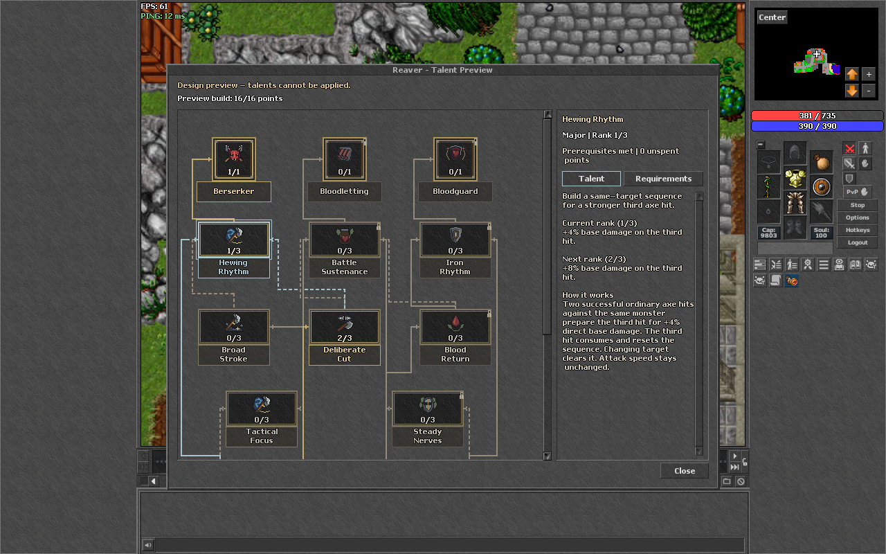
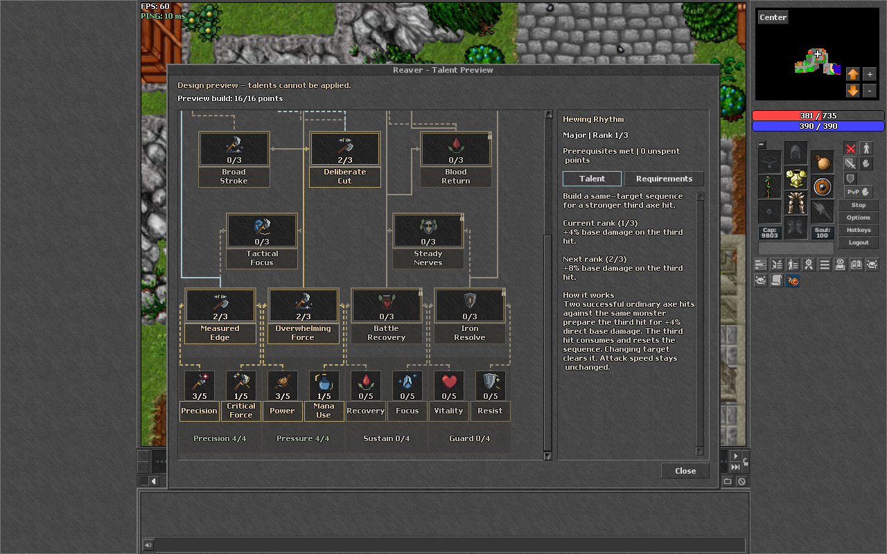
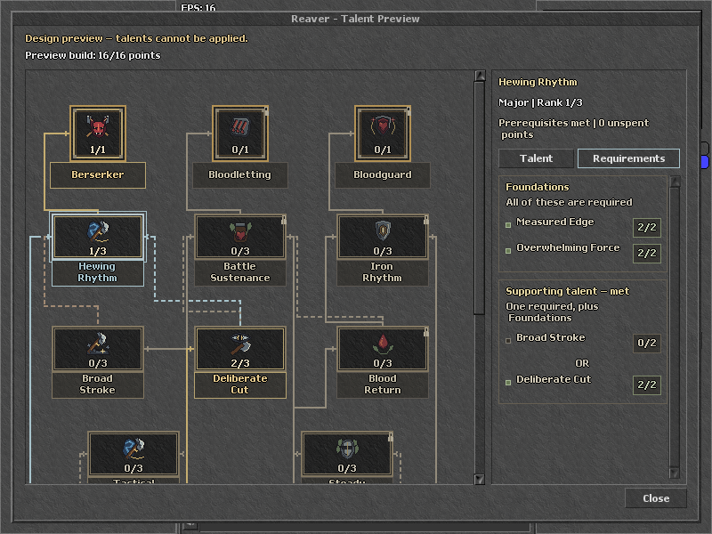

# Reaver: native in-game design preview

**Superseded structure:** the user requested alternating Minor/Major progression and distinct Capstone routes. See [the 29-node alternating revision](reaver-alternating-tree.md). The 23-node evidence below remains a record of the earlier layout and UI cleanup.

Status: 2026-10-06. The separate preview client connected to the existing local test server and rendered the proposed 23-node tree over the actual game world, using the client's retro widgets, bitmap fonts and 32px icons.

**This is a visual preview. The six proposed talents have no gameplay effects.** Apply, rank editing, respec and ending a test are disabled. Outgoing passive requests and incoming passive catalog updates are suppressed in the preview module. The local server's 17-node catalog and validation remain unchanged.

The screenshot probe verified the game connection, loaded map, all 23 talent widgets, 27 routed links, native icon dimensions, unclipped talent names, window bounds and disabled mutation controls. It also inspected the requirements and exact-rule tooltips for every talent, checked requirement text bounds, and confirmed that numeric prerequisite strips are absent from the canvas. It captured a full overview at 1280x1040, a normal 800x616 dialog at 1280x800 with both scroll positions, and a bounded window at 800x600, then logged out.

The canvas presents talents, ranks and connections without numeric rule strips. Gold indicates invested ranks; a cyan outline and additional frame identify the inspected talent. Solid lines show mandatory dependencies; short pixel dashes show alternative prerequisite links. Selected satisfied inputs are highlighted independently of other missing requirements. Stronger route states are drawn above weaker shared segments, so inactive links cannot erase an invested route.

The retro **Talent** and **Requirements** tabs share one inspector scroll area. Talent opens first, showing purpose and explicit current/next bonuses before the full mechanics. Requirements retains exact combined-point, AND/OR, investment and capstone restrictions. A completed OR group leaves unused alternatives neutral. Availability remains visible above both tabs, including zero unspent points and a conflicting capstone. Prerequisite rows navigate to the named talent. Selection resets the inspector scroll; arrows traverse the tree, Enter/Space inspect, and Tab reaches the inspector. Each talent has one keyboard focus target; frame and nameplate clicks focus that same target. Mutation controls are hidden in this read-only preview. The horizontal tree bar is hidden when its range is zero.

Native application checks exercised all 23 frame and nameplate click handlers, Enter/Space activation, all 23 talents through arrow traversal, tab focus/activation, prerequisite-row activation, partial foundation progress, neutral unused alternatives, empty/fully allocated states and conflicting capstones at 800x600. All six proposed talents were inspected at ranks 0 through 3 at each of the three viewports, with their concise benefit summaries inside the clipped inspector. Resetting an actually scrolled prerequisite panel was verified at 1280x800 and 800x600. These tests call the application's handlers; they do not deliver OS mouse/keyboard input or establish manual playtest results.

The native rendering uses the existing attached two-line nameplates; it therefore differs from the HTML draft's approximate typography. New talent icons still reuse existing icons as placeholders.

## Actual client screenshots

[Complete tree in the larger client viewport](images/reaver-connected-ingame.png)

[800x600 Talent tab](images/reaver-connected-ingame-800x600.png)

[UI and UX review](reaver-ui-ux-review.md)

## Local artifacts

- Generator: `out/tree-choice-research/build_native_preview.py`.
- Disposable package and native run logs: `out/tree-choice-research/reaver-native-preview/`.
- Catalog: `out/tree-choice-research/native-connected-catalog.json`.
- Screenshot-only local account: existing Passive Tester fixture; no class-selection, Apply, reset or test-tree chat command was sent.

**Server config.lua: no new rows are required.** The base client package and source gameplay files were not changed. No content was pushed or deployed. This verifies presentation, not combat effects or balance. The design still has the unresolved Bloodguard branch gap described in [the connected-tree draft](reaver-tree-design.md).
