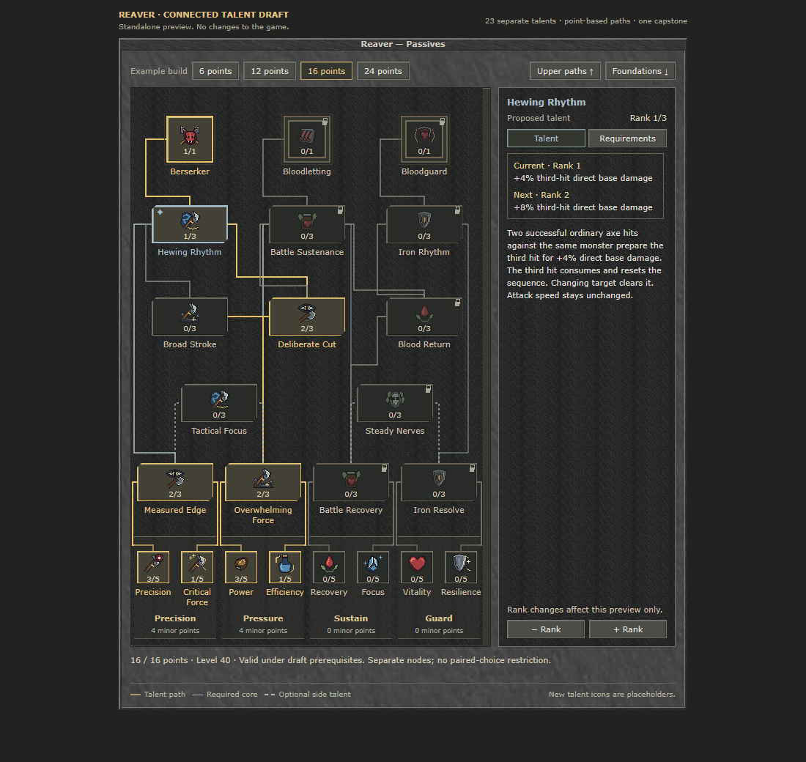
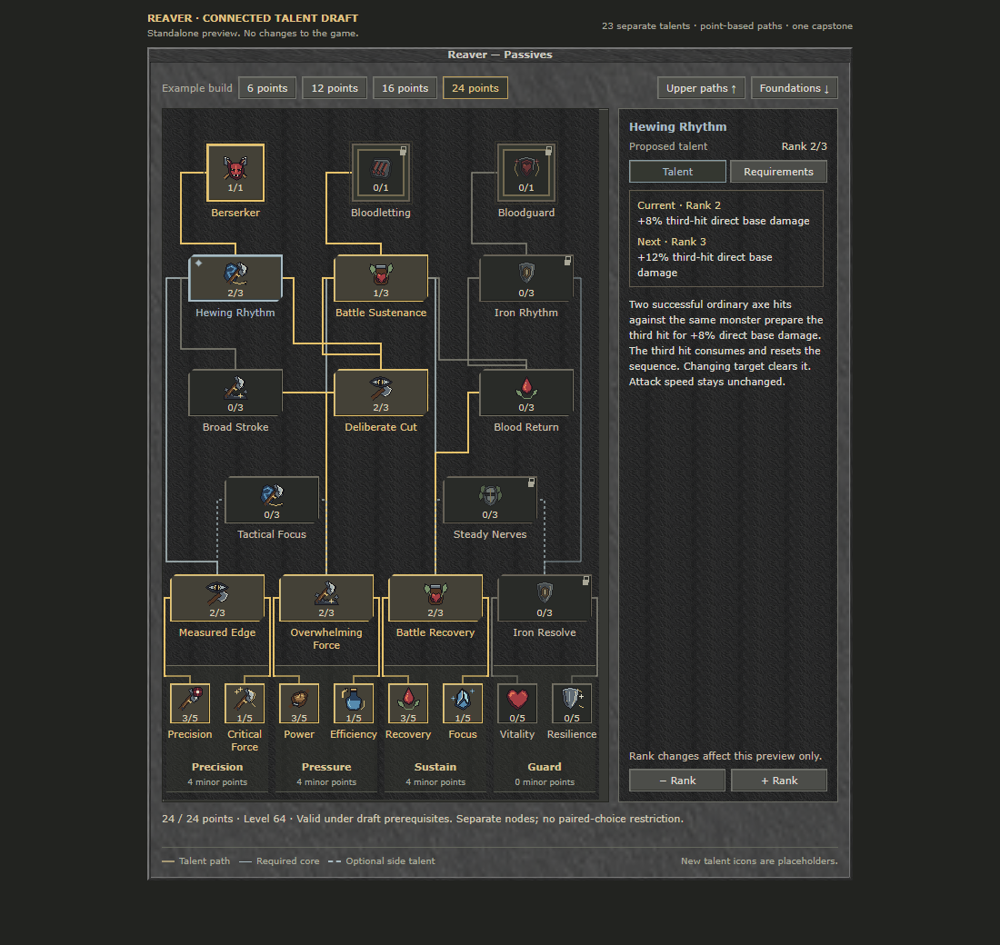
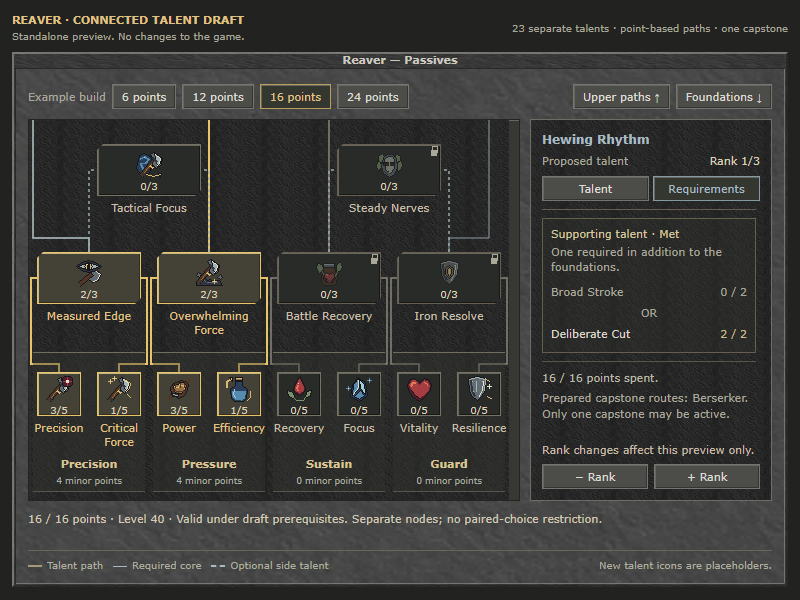

# Reaver — connected talent tree draft

**Superseded structure:** the user requested alternating Minor/Major progression and distinct Capstone routes. See [the 29-node alternating revision](reaver-alternating-tree.md). The 23-node evidence below remains a record of the earlier layout and UI cleanup.

**Status: 2026-10-06 — detached design draft, not gameplay implementation.** This proposal adds six individual connected talents to Reaver's existing seventeen. Names, values and combat behaviour remain proposed. Pictures show an HTML preview using existing retro resources, approximate Verdana text and temporary icon references; they are not screenshots of an implemented game feature.

An earlier assistant-added proposal enclosed talents in mutually exclusive choice pairs. The user rejected it; it was never an approved requirement. This draft replaces it with separate connected nodes. The point budget determines which paths fit. Only the existing one-active-capstone restriction remains.

**Server `config.lua`: NO new rows are required for this detached draft.** No gameplay, database or configuration changes are part of the sketch. Future balance settings should be stored centrally in the tracked `Rookhaven/data/lib/passives/config.lua`. Any future changes to the server's separate `config.lua` must be listed explicitly before delivery.

## Structure and prerequisites

The 23 nodes comprise eight minors in four areas, four core majors, two optional side majors, six new major-style talents and three capstones. Minors retain five ranks; existing majors and new talents have three; capstones have one.

Each core major still requires **four combined points** across its area's two minors. Either minor may remain at zero. Precision leads to Measured Edge; Pressure to Overwhelming Force; Sustain to Battle Recovery; Guard to Iron Resolve.

### Lower talents

| Talent | Required core |
| --- | --- |
| Broad Stroke | Overwhelming Force rank 2 |
| Deliberate Cut | Overwhelming Force rank 2 |
| Blood Return | Battle Recovery rank 2 |

### Upper talents

| Talent | Both named cores required | Supporting lower talent |
| --- | --- | --- |
| Hewing Rhythm | Measured Edge 2 **AND** Overwhelming Force 2 | Broad Stroke 2 **OR** Deliberate Cut 2 |
| Battle Sustenance | Overwhelming Force 2 **AND** Battle Recovery 2 | Deliberate Cut 2 **OR** Blood Return 2 |
| Iron Rhythm | Iron Resolve 2 **AND** Battle Recovery 2 | Blood Return 2 |

Every positive upper rank requires both core anchors and a qualifying lower parent. For example: `(Measured Edge 2 AND Overwhelming Force 2) AND (Broad Stroke 2 OR Deliberate Cut 2)`. Buying both lower alternatives is allowed when affordable. Removing one remains valid if another qualifying parent still supports the child.

### Capstones and optional connections

| Capstone | Required upper endpoint |
| --- | --- |
| Berserker | Hewing Rhythm rank 1 |
| Bloodletting | Battle Sustenance rank 1 |
| Bloodguard | Iron Rhythm rank 1 |

Each capstone also requires **at least 15 other spent points** and permits **only one active capstone**. Its endpoint inherits the core and lower prerequisites above. Existing capstone effects are retained in this proposal.

Tactical Focus remains optional: at least two minor points each in Precision and Pressure, plus Measured Edge **or** Overwhelming Force rank 1. Steady Nerves similarly requires two minor points each in Sustain and Guard, plus Battle Recovery **or** Iron Resolve rank 1. Neither substitutes for a required core anchor or upper endpoint.

## Six proposed effects

Values below are for ranks 1 / 2 / 3. These effects are intended to work before a capstone using existing attacks, spells and visual effects; none has been implemented or combat-tested by this sketch.

| Talent | Proposed effect |
| --- | --- |
| **Broad Stroke** | Cleaving Arc's secondary monster hits gain **4 / 8 / 12%** direct damage. Primary hit, area, mana cost and maximum three targets stay unchanged. No benefit against a single target. |
| **Deliberate Cut** | Two successful ordinary axe hits against the same monster prepare the next eligible axe spell's primary hit for **3 / 6 / 9%** extra direct damage. Includes actually learned Head Splitter and Axe Throw. Ready for 12 seconds; changing target clears it. |
| **Blood Return** | Actual direct monster damage that removes HP prepares the next ordinary axe hit to heal **3 / 6 / 9%** of that one received hit, capped at **1 / 2 / 3%** maximum HP. One charge, 12-second readiness and 8-second grant cooldown. Ward- or mana-shield-absorbed damage creates no budget. |
| **Hewing Rhythm** | Two successful ordinary axe hits against the same monster prepare the third hit for **4 / 8 / 12%** extra direct base damage. The third hit consumes and resets the sequence without simultaneously starting the next one. Target changes clear it; attack speed is unchanged. |
| **Battle Sustenance** | A successful offensive axe spell prepares the next ordinary axe hit to heal an extra **2 / 4 / 6%** of its actual primary HP damage. One charge, 12-second readiness and 8-second grant cooldown. No healing from summed area damage. |
| **Iron Rhythm** | A successful offensive axe spell prepares **2 / 4 / 6%** extra reduction of the next direct physical monster hit. One charge, 12-second readiness and 8-second grant cooldown. No new ward pool or permanent reduction. |

Names are provisional combat and discipline themes within The Nameless' existing framing, introducing no new faction, deity or separate resource. Final icons would need distinct 32px art.

## Progression and exact preview presets

Existing progression is three starting points, one additional point every three levels, capped at 24: `min(24, 3 + floor((level - 1) / 3))`. A core at rank 2 first fits at six points, level 10. The first new lower rank fits at **seven points, level 13**. The first capstone fits at **sixteen points, level 40**; maximum points arrive at level 64.

Presets are cumulative, with no respec between steps. All unlisted talents remain at zero.

| Points / level | Exact preset |
| --- | --- |
| **6 / 10** | Power 3, Efficiency 1, Overwhelming Force 2. |
| **12 / 28** | Previous preset **plus** Precision 3, Critical Force 1, Measured Edge 2. |
| **16 / 40** | Previous preset **plus** Deliberate Cut 2, Hewing Rhythm 1, Berserker 1. |
| **24 / 64** | Previous preset **plus** Recovery 3, Focus 1, Battle Recovery 2, Battle Sustenance 1; raise Hewing Rhythm from 1 to 2. Berserker stays active. Bloodletting's route is prepared, not active. |

The first capstone costs **12 foundation points + 2 lower ranks + 1 upper rank + 1 capstone = 16**. There is **no spare elective point** at this milestone. An optional side major or additional lower rank delays it. Players still choose how to distribute each area's four minor points.

| Prepared routes, including exactly one active capstone | Minimum total points |
| --- | ---: |
| Any single route | 16 |
| Berserker + Bloodletting | 23 |
| Bloodletting + Bloodguard | 23 |
| Berserker + Bloodguard | 31 |
| All three | 32 |

The 24-point budget permits some late hybrids without preparing every route. Preparing another endpoint provides its underlying effects and a potential respec destination, never a second active capstone.

**Unresolved design gap:** Bloodguard has only the Blood Return → Iron Rhythm route at the first 16-point capstone. It currently lacks the comparable lower-path choice offered by Berserker and Bloodletting. The six added talents do not yet fulfil equal choice breadth across all routes. This is a partial design, not a completed final tree.

## Balance and implementation contracts

Balance must use spells normal players can actually learn: Cleaving Arc, Rend, and Oracle Stone-learned Head Splitter and Axe Throw. Administrator access to every spell is not normal progression. Head Splitter's own critical calculation must not receive a second critical multiplier.

Percentages are starting proposals for the game's low-and-slow pace. For illustration, rank-2 Hewing Rhythm adds about 2.67% across three equal raw hits; rank-2 Battle Sustenance yields 0.8 HP from a 20-HP primary hit. Armour, rounding, misses, overkill, mana and hunting patterns determine real value. These examples do not establish combat balance or enjoyment.

Future implementation must preserve these contracts:

- Reaver only, an appropriate equipped axe, PvE monsters, successful ordinary primary attacks and actually learned allowlisted axe spells. No PvP, NPC, condition or secondary-proc triggers; misses, blocks and immunity are not successful hits.
- One charge per qualifying cast, not per area recipient. No stacking or refresh while a charge waits. Freeze completed preparation and qualifying action state; validate owner, session, revision and epoch when resolving delayed effects.
- Modify existing direct damage once. No extra attack events, attack speed, rage, bleed stacks or ward pools. Passive damage must not recursively start passive chains.
- Define bounded fractional handling for small bonuses. **Do not force a minimum of one damage per proc.** Healing fractions must not bank overhealing. Test low-damage cases and effective healing separately.
- New healing restores missing self HP only and must not trigger healing capstones. Blood Return uses one actual received HP-loss event, not whole-pack or absorbed damage. Battle Sustenance uses actual primary HP damage, never a sum across area targets.
- Apply Iron Rhythm in existing physical damage calculation before ward absorption, with one consumption per event. Preserve the combined ward limit and Aegis interaction.
- Specify expiry, full-HP, target-change, death, logout, equipment-change and respec cleanup for charges and fractions. State must not be reused under another class or weapon.

## Retro presentation

The detached preview uses a **480 × 760** canvas growing from minors through core majors, optional side majors, lower and upper talents to capstones. Every talent is an individual node with its own centred name. Glyphs are 32px; major and capstone frames follow the client's current retro shapes.

Solid paths represent mandatory dependencies; dashed links identify alternative prerequisite inputs. The canvas has no numeric prerequisite strips. The default **Talent** tab shows purpose and explicit current/next benefits; **Requirements** shares its scroll area and shows grouped rules with rank progress, distinguishing **both required** foundations from **either supporting talent**. Exact rules also appear in node tooltips. Gold marks investment; cyan plus an additional frame marks the inspected talent. No paired choice cards, forced pair locks or unexplained M/X symbols remain. At 800 × 600 the tree and detail panel scroll independently. The 6/12-point presets open at the foundations; 16/24-point presets open at the upper paths.

## Detached verification and limits

[Connected-rule evidence](../out/tree-choice-research/reaver-connected-sketch-results.json) uses the server-generated first fourteen prerequisites and extracted client requirement/validation functions, with a detached six-node overlay:

- **14 named legal builds and 231 valid purchase steps**, including exact presets, alternative parents, both offensive lower talents and late hybrids.
- **12 targeted rejections**: missing anchors, side-major substitution, insufficient lower rank, removing the only parent or endpoint, two active capstones, excess budget and rank 4 on a three-rank talent.
- All **4,096** rank-0-to-3 vectors across the six new talents: **1,960** valid foundations, **2,136** rejected foundations, **4,056** individual capstone selections and **191,727** valid purchase-prefix checks. Point sums and rank-vector maps were checked; stale production layout, description and rank metadata were deliberately omitted.

[Detached HTML UI evidence](../out/tree-choice-research/reaver-connected-ui-results.json) records **17 passing checks**, including exact presets, permitted lower-node combinations, blocked prerequisite removal, one active capstone, separate names, 23 nodes with 32px icons and 800 × 600 scrolling, with no reported errors.

[Focused UI evidence](../out/tree-choice-research/reaver-polish-ui-results.json) adds 39 passing checks for current/next values, tabs, prerequisite navigation, alternative states, shared scrolling and 800x600 visibility.

These detached checks verify the proposed graph and presentation. A separate [native in-game preview](reaver-native-preview.md) verifies this presentation in the actual retro client connected to the local server. Neither preview executes the six proposed combat effects or database migrations, or establishes gameplay balance or production-package compatibility.

## Future implementation, not performed here

An approved design would first receive an isolated local Reaver implementation. Preserve all existing seventeen IDs and indexes; append the six new IDs and explicitly version the catalog and saved-build migration. Invalid older builds would need a safe, free reset. Migration, production catalog, effects and configuration work remain unimplemented.

First resolve Bloodguard's choice breadth. Then test ordinary 16-point builds with normal equipment and learned spells: a durable target, three melee targets, low mana, short kills, physical and elemental incoming damage, and Bloodguard alongside Aegis. Measure actual HP damage, mana per kill, effective recovery, fractions and proc frequency. Preserve the spell, combat, bleed, ward, Apply/respec, HP-overlay and persistence checks in [passives-regressions.md](passives-regressions.md). Other classes need relevant paths of their own. No push or deployment belongs to this design stage.
