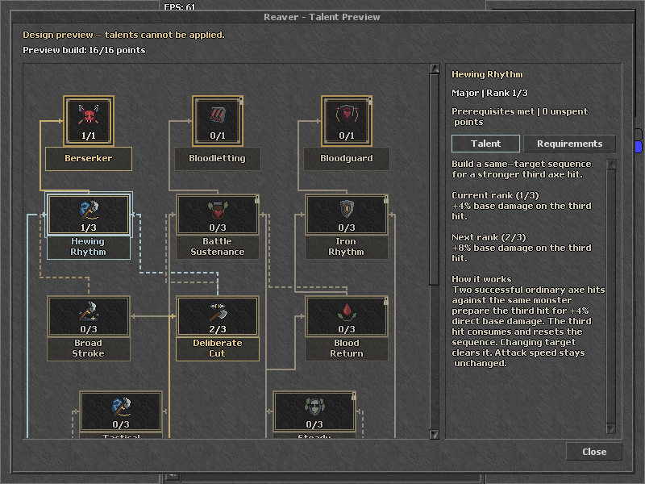

# Reaver UI and UX review

Status: 2026-10-06. Three reviewers used the UI/UX skill to examine visual hierarchy, interaction clarity, and small-window usability. Their critical review found hidden benefits, ambiguous rank values, misleading state highlighting, connector layering and keyboard-focus defects. The main issues are corrected in the isolated Reaver design previews. The earlier 23-node UI pass preserved its rules and values. The subsequent alternating 29-node design changes topology and proposes six additional Minor benefits; it remains detached from gameplay.

## Findings and corrections

| Priority | Finding | Correction |
| --- | --- | --- |
| High | Requirements occupied the entire small inspector and hid the talent benefit. | Native Talent/Requirements tabs share one scroll area. Purpose and concise current/next values appear first. |
| High | Six proposed talents displayed three-rank percentages without identifying the current or next benefit. | Presentation strings derive from the existing proposal values, including both Blood Return coefficients. Rank zero and maximum rank have explicit states. |
| High | Focusable nodes lacked keyboard activation and traversal. | Arrow navigation reaches all 23 talents; Enter/Space inspect. Tab connects the tree, inspector tabs and prerequisite rows. |
| Medium | Clicking a nameplate could leave keyboard focus on the previous talent; tabs were not focusable. | Every selection focuses its matching node. Nameplates remain mouse targets rather than extra focus stops; tabs and navigation rows have activation handlers. |
| Medium | Selected and invested gold frames competed; unmet supporting alternatives were also cyan. | Investment stays gold. Inspection uses cyan plus an additional frame; unmet inputs remain muted. |
| Medium | A missing foundation dimmed all inputs, including satisfied ones. | Each displayed input is evaluated independently; overall talent eligibility remains separate. |
| Medium | Inactive shared segments painted over invested paths. | Connector layers use state priority. Actual framebuffer samples confirm the invested trunk remains gold. |
| Medium | Alternative links used the same visual grammar as mandatory links. | Alternative links have short pixel dashes. Exact alternative requirements are shown contextually in the inspector; the persistent explanatory key was removed in the follow-up review. |
| Medium | Unused OR alternatives looked like unfinished obligations after another route qualified. | The group shows met, the unused alternative is neutral, and its subtitle states that supporting requirements supplement Foundations. |
| Medium | New selections retained the previous inspector scroll offset. | Explicit selection resets the detail scroll; tests use a genuinely overflowing prerequisite panel. |
| Medium | A partially trained talent said only requirements met despite zero available points. | Availability includes unspent points, maximum rank, missing requirements or the conflicting capstone. |
| Low | Tiny muted helper text, repeated preview metadata and dead controls added clutter. | Rule helpers use the existing 11px bitmap font with brighter text; headers are compact, disabled mutation controls are hidden, and the horizontal bar hides when unnecessary. |

## Verification

- Native retro client connected to the existing local server at 1280x1040, 1280x800 and 800x600. All 23 nodes, 27 routed connections, 32px icons, name bounds and all-node prerequisite tooltips passed.
- The six proposals at ranks 0 through 3 produced 24 benefit states per viewport. Current/next summaries fit the effective clipped inspector at each size.
- At 800x600, native application-handler checks covered 46 frame/nameplate handlers, Enter/Space, 23-node arrow reachability, tab and prerequisite navigation, independent partial-rule highlighting, neutral OR alternatives, conflicting capstones and empty/fully allocated states.
- Scrolled prerequisite panels had ranges of 80px at 1280x800 and 120px at 800x600. Selecting another talent returned them to zero. The larger overview had no overflow.
- HTML preview: 17 existing checks plus 39 focused checks passed with no reported browser errors.
- The base archive's encrypted passive module is unchanged. The follow-up below changes shared presentation source, with talent rules and combat code preserved. Native tests do not simulate OS input, establish manual hunting balance, or execute the proposed combat effects.

Evidence: [native results](../out/tree-choice-research/reaver-native-preview/native-preview-results.json), [shared-link pixels](../out/tree-choice-research/native-shared-link-pixels.json), [HTML focused results](../out/tree-choice-research/reaver-polish-ui-results.json).

## Current in-game presentation

[Complete native overview](images/reaver-connected-ingame.png)

## Follow-up: reject development clutter in player UI

The user rejected the always-visible Minor/Major/Capstone shape legend. It was not a legend-specific test widget: shared `buildTree()` created both the captions and anonymous sample frames in permanent mode. Ordinary startup currently gates this feature behind the loopback `--local-passives` profile, but that profile also exercises permanent trees. The legend would therefore have followed the shared feature into DEV when enabled.

Three independent reviewers re-audited shared source and the detached preview. Our earlier approval missed the purpose of this UI and mixed preview improvements with shared-module readiness.

| Shared finding | Fix |
| --- | --- |
| Persistent talent-type legend and three sample shapes | Removed the complete creation loop. Selected type/rank remains in inspection details. |
| Persistent 9px capstone prerequisite strip | Removed its creation and update. Exact rules remain contextual. |
| Repeated saved/draft totals | Points show available/total. Saved rank appears only when the selected draft differs; pending changes remain explicit. |
| Undo restriction replaced valid Add rank status | Undo restrictions stay on the corresponding control's tooltip. |
| Permanent catalog refresh briefly switched to test controls | Existing tree and combat HUD hide until a matching validated snapshot establishes mode; visible-tree intent is retained. |
| Dead horizontal bar and stale visibility after resizing | Actual layout range controls visibility and reserved space, including deferred initial binding and resizing without selection. |
| New selections kept old detail scrolling | Explicit selection resets detail scrolling; ordinary state updates do not. |
| Invested and inspected frames competed in gold | Inspected frames use the existing muted cyan; invested frames retain gold. |
| Static status and spell hints exposed transport details | Loading, saved-state and cost text now describes the player's action. Useful server rejection reasons remain visible. |

The isolated native and HTML previews also remove the footer key. Their design-preview disclaimer remains: those are genuinely local drafts whose additional talents have no combat implementation.

### Actual shared-module regression

`tools/run-passives-presentation.ps1` loads fresh shared Lua and OTUI into a disposable native client while retaining the original encrypted modules. Scripted packets drive the actual controller; the real game remains offline. This is separate from the connected 23-node design preview.

- Six existing 17-node/21-link classes at 1280x800 and 800x600 passed absence of legend captions, anonymous samples, capstone hints and visible test-mode copy in permanent mode.
- Selected type/ranks, available points, editing controls and free/paid Respec states passed.
- New-session catalogs hide both an open tree and an explicitly opened combat HUD; valid permanent snapshots restore the tree.
- Wide/narrow/wide resizing without reselection passed zero/positive/zero horizontal overflow and corresponding visibility.
- The fresh-source normal-profile init/terminate guard was inert. Zero outgoing passive requests were sent.
- 636 encrypted module entries and the base package stayed byte-identical. A generic widget cleanup warning remains at shutdown; no assertion, ERROR or FATAL remained.

Evidence: [native presentation log](../out/passives-presentation/run.log) and [package manifest](../out/passives-presentation/presentation-manifest.json). Native handler tests do not establish OS pointer hit testing or keyboard event dispatch. Shared keyboard traversal remains separate from the preview's keyboard handlers.

## Alternating structure follow-up

The latest Reaver design is documented in [the alternating-tree draft](reaver-alternating-tree.md). Six new independent middle Minors produce a Minor -> Major -> Minor -> Major -> Capstone spine, with optional existing side Majors kept at the core tier. The 29-node draft stays isolated from the unchanged 17-node live catalog.

The final native rendering passes at three viewport sizes. A separate rule proof covers all six routes at 16 points and the 24-point limit. Added effects and placeholder icons remain proposals; layout verification is not combat-balance approval.

## Connector follow-up

The user found the earlier always-visible connections difficult to trace. The revised [alternating-tree preview](reaver-alternating-tree.md) now uses separate card ports and short main paths, while showing one supporting prerequisite connection only when its advanced talent is inspected. Both named AND requirements also appear in the default inspector, including at 800x600.

The earlier clearance review missed line-to-line intersections. The new geometry/native checks inspect actual two-pixel stroke rectangles and selection transitions. The pass also corrected neutral-color handling for missing optional-core inputs and focus-style restoration that could leave untrained Capstones with a gold border.

These are isolated preview changes. The shared 17-node controller/catalog and server gameplay remain unchanged by this connector follow-up.

## Remaining work

The new talents still reuse existing icons. Distinct 32px icons are needed before final art approval. The earlier Bloodguard route-design gap is superseded by [the alternating 29-node draft](reaver-alternating-tree.md). That draft adds separate route Minors and specific lineage gates; this shared presentation cleanup changes no live progression rules. Manual mouse/keyboard playtesting remains separate from application-handler verification. The detail scrollbar currently remains visible even when its range is zero, matching the existing retro inspector.

**Server config.lua: NO new rows are required.** Server code, database and gameplay settings were not changed. No push or deployment was performed.
